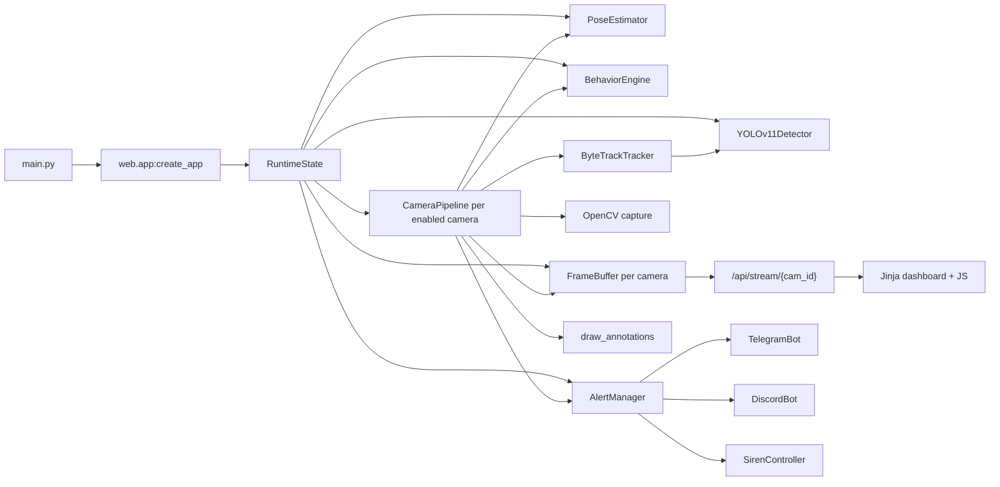

# SCT Camera System Documentation

Tài liệu này mô tả cách project vận hành ở mức hệ thống: startup, realtime pipeline, analytics, dashboard, API, cấu hình, alerting và các điểm cần biết khi sửa code.

## 1. Mô Hình Tổng Quát

SCT Camera là một hệ thống giám sát video realtime. App nhận source từ webcam, file video hoặc RTSP, chạy detection/tracking, áp rule hành vi, vẽ annotation, stream MJPEG lên dashboard và gửi alert qua Telegram/Discord/siren.

Luồng chính:

```text
Camera/Webcam/Video/RTSP
  -> OpenCV capture
  -> CameraPipeline thread
  -> YOLOv11 + ByteTrack + camera motion compensation
  -> optional pose estimation
  -> identity labeling
  -> behavior analytics
  -> annotated frame
  -> FrameBuffer for MJPEG dashboard
  -> AlertManager queue
  -> Telegram / Discord / local siren / alert history
```

Sơ đồ module:



## 2. Cấu Trúc Thư Mục

| Path | Vai trò |
| --- | --- |
| `main.py` | Entry point. Set workaround OpenCV, load config, tạo FastAPI app, chạy Uvicorn. |
| `config/settings.yaml` | Global settings: detection, tracking, behavior, notification, pipeline, web, logging. Có chứa secret runtime, không nên public. |
| `config/cameras/*.yaml` | Registry camera. Mỗi file là một camera source, trạng thái enabled, zones, lines, alert channels. |
| `core/` | Vision pipeline primitives: detector, tracker, pose, frame buffer, camera pipeline. |
| `analytics/` | Các rule hành vi và behavior learning. `BehaviorEngine` là orchestrator. |
| `notifications/` | Telegram, Discord, siren và `AlertManager` queue/cooldown/history. |
| `web/` | FastAPI app, routes, Jinja templates, static JS/CSS dashboard. |
| `scripts/train_behavior_classifier.py` | Train logistic risk model từ event log đã label. |
| `docs/behavior-learning.md` | Workflow riêng cho behavior learning. |
| `logs/` | File log runtime, mặc định `logs/sct_camera.log`. |
| `data/` | Runtime data nếu bật behavior learning, ví dụ `behavior_events.jsonl` và labels CSV. |
| `models/` | Model behavior classifier sinh ra sau khi train. |

## 3. Startup Lifecycle

Khi chạy:

```powershell
python main.py
```

App đi qua các bước:

1. `main.py` set environment workaround cho OpenCV trên Windows:
   - tắt OBSENSOR priority để tránh lỗi chiếm camera index;
   - tắt MSMF hardware transforms để giảm lỗi/hang webcam UVC;
   - ép RTSP qua TCP cho FFMPEG.
2. Load `config/settings.yaml` bằng `load_settings`.
3. Setup logging bằng `utils.logger.setup_logging`.
4. Load toàn bộ `config/cameras/*.yaml` bằng `load_camera_configs`.
5. Tạo `RuntimeState`, trong đó khởi tạo các service dùng chung:
   - `YOLOv11Detector`;
   - `PoseEstimator`;
   - `BehaviorEngine`;
   - `AlertManager`;
   - `FrameBuffer` cho từng camera.
6. `create_app` tạo FastAPI app, mount static files và include routes.
7. FastAPI startup gọi `RuntimeState.start()`:
   - start async alert worker;
   - start `CameraPipeline` cho từng camera đang `enabled: true`.
8. Uvicorn phục vụ dashboard theo `web.host` và `web.port`.

Shutdown:

1. FastAPI shutdown gọi `RuntimeState.stop()`.
2. Runtime stop tất cả camera pipeline threads.
3. Runtime stop alert worker.
4. Pipeline release camera/video capture và set frame buffer về offline.

## 4. RuntimeState Là Trung Tâm Điều Phối

`web/app.py::RuntimeState` giữ state runtime và là layer duy nhất mà routes nên gọi.

RuntimeState quản lý:

| Thuộc tính | Ý nghĩa |
| --- | --- |
| `settings` | Global settings trong memory, deep-copy từ YAML. |
| `cameras` | Camera configs trong memory. |
| `settings_path`, `cameras_dir` | Nơi persist YAML khi user chỉnh từ UI/API. |
| `frame_buffers` | Buffer frame/status cho từng camera. |
| `detector` | YOLO model dùng chung. |
| `pose_estimator` | Pose model optional, dùng chung. |
| `behavior_engine` | Orchestrator các behavior rules. |
| `alert_manager` | Queue gửi alert, cooldown, history. |
| `pipelines` | CameraPipeline đang chạy, index theo `camera_id`. |

Nguyên tắc ownership:

- Routes không tự sửa file YAML; routes gọi method của `RuntimeState`.
- RuntimeState chịu trách nhiệm persist settings/camera config.
- Pipeline đọc camera config qua copy và có thể nhận update bằng `update_config`.
- Detector/pose dùng chung để tiết kiệm GPU/RAM; inference được guard bằng lock.

## 5. Camera Pipeline Realtime

Mỗi camera enabled chạy trong một thread riêng: `core/pipeline.py::CameraPipeline`.

Pipeline loop:

1. Lấy config hiện tại của camera.
2. Parse `source`:
   - integer hoặc string số: webcam index;
   - path: video file;
   - `rtsp://...`: RTSP stream.
3. Open capture:
   - RTSP dùng `cv2.CAP_FFMPEG`;
   - webcam thử backend theo `pipeline.camera_backend`, rồi fallback `MSMF`, `DSHOW`, `ANY`;
   - video file dùng OpenCV default.
4. Read frame liên tục.
5. Resize frame nếu cao hơn `pipeline.processing_max_height`.
6. Chỉ xử lý detection/tracking mỗi `pipeline.frame_skip` frame.
7. Nếu tới frame cần xử lý:
   - `ByteTrackTracker.track(frame)`;
   - `PoseEstimator.attach(frame, objects)` nếu pose enabled;
   - `BehaviorEngine.label_objects(...)` để gắn identity;
   - `BehaviorEngine.analyze(...)` để tạo alert candidates.
8. Lấy line counters và stranger watch states để vẽ overlay.
9. `draw_annotations(...)` tạo frame đã annotate.
10. Với mỗi alert:
    - thêm `notification_channels` từ camera config;
    - attach bản copy frame vào alert;
    - enqueue qua `AlertManager.enqueue_threadsafe`.
11. Update `FrameBuffer` với JPEG mới, status, object count, alert count, FPS.

Video file behavior:

- `pipeline.realtime_video_playback: true` cố phát theo FPS của file.
- `pipeline.loop_video_files: true` tua lại đầu file khi hết video.
- `pipeline.drop_late_video_frames: true` bỏ bớt frame nếu xử lý chậm hơn realtime.

Reconnect behavior:

- Nếu không mở được source, pipeline set status offline và retry theo `reconnect_delay`.
- Nếu vượt `max_reconnect_attempts`, pipeline exit.
- Nếu stream đang chạy bị disconnect, pipeline release capture rồi reconnect.

## 6. Detection, Tracking, Pose

### Detection

`core/detector.py::YOLOv11Detector` load Ultralytics YOLO model từ `detection.model`.

Các setting chính:

| Key | Tác dụng |
| --- | --- |
| `detection.model` | Model path/name, ví dụ `yolo11n.pt`. |
| `detection.confidence` | Confidence threshold. |
| `detection.iou` | IoU threshold. |
| `detection.classes` | COCO class IDs được detect/track. |
| `detection.device` | `cuda:0` hoặc `cpu`. |
| `detection.half` | Dùng FP16 khi chạy CUDA. |
| `detection.imgsz` | Inference image size. |

Nếu `cuda:0` được config nhưng PyTorch không thấy CUDA, detector fallback CPU và tắt half precision.

### Tracking

`core/tracker.py::ByteTrackTracker` chạy một Ultralytics `BYTETracker` riêng cho mỗi camera với
`tracker="bytetrack.yaml"` mặc định. Nếu bật CMC, tracker ước lượng chuyển động toàn cục giữa
hai frame và bù trạng thái Kalman trước bước association.

Tracker giữ:

- `track_id`;
- bbox hiện tại;
- class name/confidence;
- `center_history` để phục vụ line crossing, suspicious movement, theft scoring;
- object cũ trong vài frame qua `tracking.track_grace_frames`;
- dedupe object cùng class theo `tracking.duplicate_iou_threshold`.
- camera motion compensation qua `tracking.camera_motion_compensation`.

CMC mặc định dùng sparse optical flow với affine transform. Nếu frame thiếu feature hoặc phép ước
lượng thất bại, tracker dùng identity transform và tiếp tục xử lý thay vì làm hỏng pipeline. CMC phù
hợp với rung hoặc pan nhẹ; nó không thay thế calibration cho camera PTZ quay góc lớn.

### Pose

`core/pose.py::PoseEstimator` chỉ chạy khi:

- `pose.enabled: true`;
- có object class `person`;
- pose model tồn tại hoặc `pose.allow_download: true`.

Pose keypoints được match lại vào tracked person bằng IoU bbox. Theft rule dùng wrist keypoints để nhận tín hiệu `pose_push_contact`.

## 7. Identity Labeling

`analytics/person_identity.py::PersonIdentityResolver` gắn label trước khi chạy behavior rules.

Behavior hiện tại:

- `person`: nếu match reference image thì `identity_kind="known_person"`, ngược lại là stranger.
- `cat`/`dog`: gắn kind dạng animal label để dashboard/annotation dễ hiển thị.
- Các object khác giữ nguyên.

Known person config nằm trong `config/settings.yaml`:

```yaml
identity:
  enabled: true
  unknown_person_label: Stranger
  model: buffalo_l
  model_root: models/insightface
  device: auto
  similarity_threshold: 0.45
  detection_size: 640
  min_detection_score: 0.5
  min_face_size: 24
  recognition_interval_frames: 5
  known_persons:
  - name: Ba
    reference_images:
    - config/known_people/ba_front.jpg
```

Resolver chạy InsightFace một lần trên toàn frame, ghép face bbox vào person
bbox, rồi so cosine embedding với các ảnh tham chiếu. Kết quả known person được
cache theo `(camera_id, track_id)`; các track chưa biết được thử lại theo
`recognition_interval_frames`. Inference được khóa để nhiều camera không gọi
chung ONNX session đồng thời.

Model `buffalo_l` tự tải ở lần dùng đầu tiên. Pretrained model do InsightFace
cung cấp chỉ dành cho nghiên cứu phi thương mại; production thương mại cần
model có giấy phép phù hợp.

## 8. Behavior Analytics

`analytics/behavior_engine.py::BehaviorEngine` là orchestrator. Mỗi frame đã track đi qua các rule theo thứ tự:

1. `IntrusionDetector`
2. `LoiteringDetector`
3. `SuspiciousStrangerDetector`
4. `AssetWatchDetector`
5. `SuspiciousTheftDetector`
6. `LineCounter`
7. `BehaviorLearningService.enrich_alerts`

### Zone Và Line Model

Zone nằm trong camera YAML:

```yaml
zones:
- id: gate_zone
  name: Gate
  type: intrusion
  polygon:
  - [0.10, 0.20]
  - [0.80, 0.20]
  - [0.80, 0.90]
  - [0.10, 0.90]
  threshold_seconds: 30
```

Line nằm trong camera YAML:

```yaml
lines:
- id: entry_line
  name: Front Entry
  point1: [0.25, 0.50]
  point2: [0.75, 0.50]
  direction: forward
```

Coordinate rule:

- Nếu `x` và `y` trong khoảng `0.0..1.0`, code hiểu là normalized coordinate.
- Nếu lớn hơn 1, code hiểu là pixel coordinate.
- UI editor hiện lưu normalized coordinate, nên config ít phụ thuộc resolution.

Zone type:

| Type | Rule áp dụng |
| --- | --- |
| `all` | Áp dụng cho mọi rule dựa trên zone. |
| `intrusion` | Intrusion. |
| `loitering` | Loitering. |
| `stranger_watch` | Suspicious stranger. |
| `asset_watch` | Asset removal và suspicious theft. |
| `counting` | Legacy/placeholder cho vùng counting; line counter dùng `lines`, không dùng zone. |

### Rule Summary

| Rule | Input | Khi nào alert |
| --- | --- | --- |
| Intrusion | Zone `intrusion` hoặc legacy `all` | Báo một lần khi person bắt đầu chiếm vùng. Chỉ re-arm sau khi vùng không còn person quá `intrusion_reset_frames`; class mặc định là `person`. |
| Loitering | Zone `loitering` hoặc `all` | Object ở trong zone lâu hơn `threshold_seconds` hoặc `behavior.loitering_threshold_seconds`. |
| Suspicious stranger | Zone `stranger_watch` hoặc `all` | Unknown person ở trong zone đủ lâu và có pattern đứng yên hoặc đi qua lại gần khu vực. |
| Asset watch | Zone `asset_watch` hoặc `all` | Asset biến mất hoặc rời zone sau khi có unknown person ở gần trong window thời gian. |
| Suspicious theft | Zone `asset_watch` hoặc `all` | Unknown person ở gần vehicle/asset và đủ score từ duration, pacing, vehicle movement, same direction, pose push. |
| Line crossing | `lines` | Track center đi qua line, tăng counter `in/out` và tạo alert `line_crossing`. |

### Alert Payload

Các rule trả về dict alert. Trường phổ biến:

```text
type
camera_id
camera_name
track_id
class_id / class_name
zone_id / zone_name hoặc line_id / line_name
timestamp
details
siren
```

Pipeline sẽ thêm:

- `notification_channels` từ camera config;
- `frame` là annotated frame copy để notification gửi ảnh.

`BehaviorLearningService` có thể thêm:

- `behavior_event_id`;
- `behavior_features`;
- `behavior_risk_score`;
- `behavior_suppressed` nếu bật gate.

## 9. Behavior Learning Pipeline

Behavior learning nằm sau rule-based analytics. Rule vẫn là nguồn tạo candidate trước.

Luồng:

```text
Behavior rules produce alerts
  -> BehaviorLearningService extracts numeric features
  -> append JSONL candidate event
  -> optional logistic model scores risk
  -> optional gate suppresses low-risk alerts
  -> remaining alerts go to AlertManager
```

Artifacts:

| File | Ý nghĩa |
| --- | --- |
| `data/behavior_events.jsonl` | Candidate events được append khi runtime chạy. |
| `data/behavior_labels.csv` | Labels do user/API tạo. |
| `models/behavior_classifier.npz` | Logistic model train bằng script. |

Training:

```powershell
.\.venv\Scripts\python.exe scripts\train_behavior_classifier.py --labels data\behavior_labels.csv
```

API hỗ trợ:

```text
GET /api/behavior-events?limit=100
POST /api/behavior-events/{event_id}/label
```

Chi tiết label workflow nằm ở `docs/behavior-learning.md`.

## 10. Alert Manager Và Notification

`notifications/alert_manager.py::AlertManager` chạy một async worker trong event loop của FastAPI.

Pipeline thread không await trực tiếp. Thay vào đó:

1. Pipeline gọi `enqueue_threadsafe(alert)`.
2. AlertManager dùng `loop.call_soon_threadsafe` để put vào `asyncio.Queue`.
3. Worker xử lý từng alert.
4. Cooldown được kiểm theo key:

```text
(camera_id, alert_type, zone_id|line_id|zone_name|line_name|global)
```

5. Nếu còn cooldown:
   - alert được ghi history với `suppressed: true`;
   - không gửi Telegram/Discord/siren.
6. Nếu không cooldown:
   - gửi Telegram nếu channel có `telegram`;
   - gửi Discord nếu channel có `discord`;
   - trigger siren nếu alert có `siren: true`;
   - ghi history.

Alert history:

- In-memory, không persist DB.
- Mỗi camera giữ tối đa 200 records.
- API đọc qua `GET /api/alerts/{cam_id}`.
- Restart app sẽ mất history.

Notification config:

```yaml
telegram:
  bot_token: "<secret>"
  chat_id: "<chat/group id>"
  enabled: true
  cooldown_seconds: 10
  max_retries: 3

discord:
  webhook_url: "<secret>"
  username: SCT Camera
  enabled: true
  max_retries: 3
```

Security note: app hiện đọc token/webhook trực tiếp từ `config/settings.yaml`. Không commit file này lên repo public nếu chứa credential thật.

## 11. FrameBuffer Và MJPEG Streaming

`core/frame_buffer.py::FrameBuffer` là boundary thread-safe giữa pipeline thread và web stream.

Nó giữ:

- latest annotated frame;
- latest JPEG bytes;
- status (`offline`, `connecting`, `online`, `degraded`, `paused`);
- object count;
- alert count;
- FPS estimate;
- version number.

`/api/stream/{cam_id}` dùng `wait_for_jpeg(last_version)`:

- Nếu có frame mới, trả JPEG mới.
- Nếu chưa có frame, trả placeholder image có status/error.
- Streaming response dùng MJPEG boundary `multipart/x-mixed-replace`.

Dashboard `` hiển thị stream mà không cần WebSocket.

## 12. Web Dashboard Và API Workflow

Pages:

| Route | Template | Vai trò |
| --- | --- | --- |
| `/` | `dashboard.html` | Live wall nhiều camera, metrics, bật/tắt camera. |
| `/camera/{cam_id}` | `camera_detail.html` | Stream lớn, ROI editor, line editor, alert table. |
| `/settings` | `settings.html` | Camera registry, detection/behavior/pipeline/notification settings. |

Static JS:

| File | Vai trò |
| --- | --- |
| `web/static/js/main.js` | Fetch wrapper, polling `/api/cameras`, update metrics, settings forms, test alert buttons, camera toggles. |
| `web/static/js/roi_editor.js` | Vẽ/sửa polygon trên stream, save/delete zones qua zone API. |
| `web/static/js/line_editor.js` | Vẽ/sửa line endpoints, save/delete lines qua line API. |

Important API:

| Method | Path | Chức năng |
| --- | --- | --- |
| `GET` | `/api/cameras` | List camera config + runtime status. |
| `POST` | `/api/cameras` | Create/update camera, persist YAML, restart pipeline nếu enabled. |
| `DELETE` | `/api/cameras/{cam_id}` | Xóa camera, stop pipeline, xóa YAML. |
| `POST` | `/api/cameras/{cam_id}/enabled` | Persist enabled state và start/stop pipeline. |
| `GET/POST/DELETE` | `/api/cameras/{cam_id}/zones` | Quản lý ROI zones. |
| `GET/POST/DELETE` | `/api/cameras/{cam_id}/lines` | Quản lý counting lines. |
| `PUT` | `/api/settings` | Deep-merge settings, persist YAML, áp dụng phần runtime-safe. |
| `POST` | `/api/settings/telegram/test` | Gửi test Telegram. |
| `POST` | `/api/settings/discord/test` | Gửi test Discord. |
| `POST` | `/api/detection/toggle/{cam_id}` | Pause/resume detection không persist camera config. |
| `POST` | `/api/detection/toggle-all` | Pause/resume detection cho enabled cameras, không persist enabled state. |
| `GET` | `/api/alerts/{cam_id}` | Alert history in-memory. |
| `GET` | `/api/behavior-events` | Behavior learning candidates. |
| `POST` | `/api/behavior-events/{event_id}/label` | Gán label cho candidate. |

Lưu ý UI hiện dùng `/api/cameras/{cam_id}/enabled` cho switch online/offline, nghĩa là có persist vào camera YAML. Endpoint `/api/detection/toggle*` là runtime pause/resume riêng và không đổi config.

## 13. Config Model

### Global Settings

Các nhóm chính trong `config/settings.yaml`:

| Group | Ý nghĩa |
| --- | --- |
| `telegram` | Telegram bot token/chat id, enable, cooldown, retry. |
| `discord` | Webhook URL, username, enable, retry. |
| `detection` | YOLO model/device/classes/confidence/IoU/imgsz. |
| `pose` | Pose model và điều kiện download. |
| `tracking` | ByteTrack config, history, grace frames, duplicate threshold và camera motion compensation. |
| `behavior` | Threshold và parameter cho intrusion/loitering/stranger/asset/theft. |
| `behavior_learning` | Event log, model path, risk gate. |
| `identity` | Known people references và unknown label. |
| `siren` | Local beep/command behavior cho high severity alerts. |
| `pipeline` | Frame skip, reconnect, processing size, video loop/drop, stream size, camera backend. |
| `web` | Host/port dashboard. |
| `logging` | Log level và file path. |

`PUT /api/settings` deep-merge payload vào settings hiện tại. Sau khi save, runtime áp dụng một phần thay đổi mà không restart:

- notification bots được rebuild;
- behavior engine được rebuild;
- detector threshold/class/imgsz/iou được update;
- pose settings được update;
- pipeline runtime knobs được update;
- frame buffer stream height được update.

Một số thay đổi vẫn nên restart để chắc chắn sạch state:

- đổi model YOLO chính;
- đổi device CPU/GPU;
- đổi cấu trúc lớn của camera registry ngoài API;
- sửa code behavior rule.

### Camera Config

Ví dụ:

```yaml
camera_id: front_gate
name: Front Gate
source: 0
enabled: true
notification_channels:
- telegram
- discord
zones:
- id: gate_roi
  name: Gate ROI
  type: intrusion
  polygon:
  - [0.10, 0.20]
  - [0.80, 0.20]
  - [0.80, 0.90]
  - [0.10, 0.90]
lines:
- id: entry_line
  name: Entry Line
  point1: [0.30, 0.50]
  point2: [0.70, 0.50]
  direction: forward
```

`source` có thể là:

- `0`, `1`, ... cho webcam index;
- đường dẫn video file;
- RTSP URL.

`notification_channels` được normalize về subset `telegram`, `discord`. Nếu thiếu hoặc invalid, runtime fallback `telegram`.

## 14. Logging Và Runtime Artifacts

Logging:

- Console log qua Python logging.
- File log theo `logging.file`, mặc định `logs/sct_camera.log`.

Runtime/generated artifacts:

| Path | Nguồn tạo |
| --- | --- |
| `logs/sct_camera.log` | Runtime logging. |
| `data/behavior_events.jsonl` | BehaviorLearningService khi `log_candidates: true`. |
| `data/behavior_labels.csv` | API label event hoặc user tạo thủ công. |
| `models/behavior_classifier.npz` | Training script. |
| `config/cameras/*.yaml` | UI/API camera/zone/line changes. |
| `config/settings.yaml` | UI/API settings changes. |

## 15. Performance Tuning

Các knob ảnh hưởng nhiều nhất:

| Setting | Tăng lên thì | Giảm xuống thì |
| --- | --- | --- |
| `pipeline.frame_skip` | Nhẹ GPU/CPU hơn, alert chậm hơn. | Mượt/chính xác hơn, tốn tài nguyên hơn. |
| `pipeline.processing_max_height` | Frame lớn hơn, chính xác hơn, chậm hơn. | Nhanh hơn, có thể mất object nhỏ. |
| `detection.imgsz` | Chính xác hơn, chậm hơn. | Nhanh hơn, có thể kém chính xác. |
| `detection.model` | Model lớn chính xác hơn, nặng hơn. | Model nhỏ nhanh hơn. |
| `detection.classes` | Nhiều class hơn, nhiều object/rule hơn. | Ít class hơn, nhẹ hơn và ít noise hơn. |
| `tracking.track_grace_frames` | Track ổn hơn khi mất detection ngắn. | Ít stale object hơn. |
| `tracking.duplicate_iou_threshold` | Dedupe mạnh/yếu tùy threshold. | Cần tune nếu thấy duplicate boxes. |
| `tracking.camera_motion_compensation.enabled` | Ổn định association khi camera rung/pan nhẹ. | Tắt để giảm thêm chi phí CPU với camera cố định tuyệt đối. |
| `tracking.camera_motion_compensation.downscale` | Giá trị nhỏ giữ nhiều chi tiết hơn. | Giá trị lớn chạy optical flow nhanh hơn. |

Vì detector dùng chung một model và lock inference, nhiều camera sẽ chia sẻ GPU theo kiểu tuần tự ở bước inference. Nếu scale nhiều camera, bottleneck chính thường là YOLO inference, không phải FastAPI.

## 16. Troubleshooting Nhanh

### Camera offline hoặc không mở được webcam

Kiểm tra:

- `source` đúng index/path/RTSP URL chưa;
- `pipeline.camera_backend` là `msmf`, `dshow` hay `any`;
- webcam có đang bị app khác chiếm không;
- log có lỗi OpenCV backend không;
- với RTSP, camera có yêu cầu TCP/UDP cụ thể không.

### Video file chạy quá nhanh hoặc quá chậm

Kiểm tra:

- `pipeline.realtime_video_playback`;
- FPS metadata của file;
- `pipeline.drop_late_video_frames`;
- GPU/CPU có theo kịp detection không.

### CUDA không chạy

Kiểm tra:

```powershell
python -c "import torch; print(torch.cuda.is_available())"
```

Nếu false, detector fallback CPU. Cần cài PyTorch CUDA build đúng CUDA driver.

### Pose không hoạt động

Kiểm tra:

- `pose.enabled: true`;
- file model `yolo11n-pose.pt` có tồn tại không;
- nếu không có file local, `pose.allow_download` phải true và máy phải có Internet;
- chỉ person objects mới chạy pose attach.

### Không có alert

Kiểm tra:

- camera có zone/line chưa;
- zone polygon có ít nhất 3 điểm;
- zone type có match rule không;
- object class có nằm trong `detection.classes` không;
- threshold có quá cao không;
- alert có bị `behavior_learning.gate_alerts` suppress không.

### Alert gửi quá nhiều

Tune:

- `telegram.cooldown_seconds`;
- zone `threshold_seconds`;
- behavior thresholds;
- camera-specific `notification_channels`;
- detection confidence/IoU/classes.

### Alert không gửi ra Telegram/Discord

Kiểm tra:

- `enabled` của channel;
- token/webhook/chat id;
- camera `notification_channels`;
- network;
- log retry trong `logs/sct_camera.log`;
- history API có `sent`, `suppressed`, `telegram_sent`, `discord_sent` không.

## 17. Khi Sửa Code Nên Bắt Đầu Từ Đâu

### Thêm behavior rule mới

1. Tạo detector mới trong `analytics/`.
2. Define input cần dùng: zones, lines, tracked objects, pose, identity, frame shape.
3. Instantiate trong `BehaviorEngine.__init__`.
4. Gọi rule trong `BehaviorEngine.analyze`.
5. Nếu cần zone type mới:
   - update API validation trong `web/routes/config_api.py`;
   - update ROI editor/UI nếu user cần chọn type;
   - update docs/config examples.
6. Trả alert payload theo shape chung.
7. Nếu rule nên gửi siren, set `siren: true`.

### Thêm notification channel mới

1. Implement sender trong `notifications/`.
2. Update `AlertManager` để build client, đọc channel, gửi song song.
3. Update `ALERT_CHANNELS` và `_normalize_notification_channels`.
4. Update settings UI/API nếu user cần cấu hình channel.
5. Update camera config docs.

### Thêm field settings mới

1. Thêm default usage trong module sở hữu behavior đó.
2. Nếu chỉnh được từ UI, update `settings.html` và `main.js`.
3. Nếu cần apply runtime không restart, update `RuntimeState.update_settings`.
4. Nếu không apply runtime được, ghi rõ cần restart.

### Thêm API mới

1. Đặt route trong `web/routes/config_api.py` nếu liên quan runtime/config.
2. Thêm method vào `RuntimeState` để giữ ownership state/persistence.
3. Nếu route đọc frame/stream, dùng `FrameBuffer` thay vì chạm trực tiếp pipeline internals.

## 18. Known Constraints

- Dashboard chưa có authentication. Chỉ nên chạy trong LAN hoặc sau reverse proxy có auth.
- Secrets đang nằm trong YAML settings nếu user nhập từ UI.
- Alert history chỉ in-memory, restart là mất.
- Camera settings persist bằng YAML file, chưa có database.
- Behavior rules là stateful trong memory; restart sẽ reset state/counters.
- Detector model dùng chung lock inference; nhiều camera có thể nghẽn ở GPU inference.
- Identity resolver phụ thuộc chất lượng/góc mặt và threshold; không nên xem là xác thực danh tính tuyệt đối.
- Behavior learning model là logistic classifier nhẹ, không thay thế rule engine.
- Project hiện chưa có test suite rõ ràng; thay đổi behavior nên được test bằng video sample hoặc script riêng.
