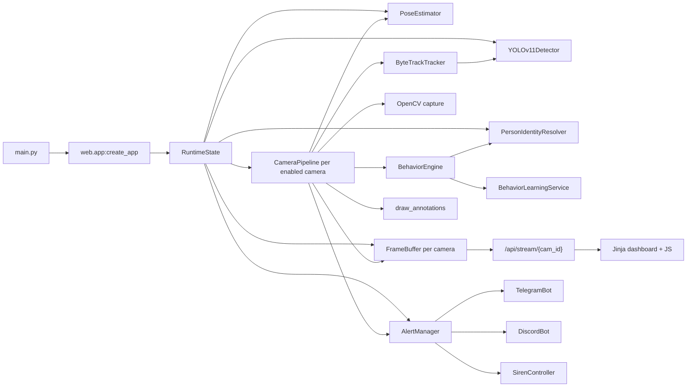

# SCT Camera System Documentation

Tài liệu này mô tả trạng thái hệ thống hiện tại của SCT Camera: startup, realtime pipeline, identity, behavior analytics, notification, dashboard/API, dữ liệu runtime, SQLite migration foundation, benchmark/backup scripts, test suite và các điểm cần nhớ khi sửa code.

## 1. Mục tiêu hệ thống

SCT Camera là hệ thống giám sát video realtime. App nhận source từ webcam, file video hoặc RTSP, chạy YOLOv11 detection, ByteTrack tracking, pose optional, identity labeling, behavior rules, vẽ annotation, stream MJPEG lên dashboard và gửi alert qua Telegram/Discord/siren.

Luồng chính:

```text
Camera/Webcam/Video/RTSP
  -> OpenCV capture
  -> CameraPipeline capture thread
  -> bounded async analysis slot per camera
  -> YOLOv11 + ByteTrack
  -> optional YOLO pose
  -> InsightFace identity labeling
  -> behavior analytics
  -> annotated frame
  -> FrameBuffer MJPEG dashboard
  -> AlertManager async queue
  -> Telegram / Discord / local siren / SQLite alert history
```

Sơ đồ module:


```mermaid
flowchart LR
    Main["main.py"] --> App["web.app:create_app"]
    App --> Runtime["RuntimeState"]
    Runtime --> Detector["YOLOv11Detector"]
    Runtime --> Pose["PoseEstimator"]
    Runtime --> Identity["PersonIdentityResolver"]
    Runtime --> Alerts["AlertManager"]
    Runtime --> Buffers["FrameBuffer per camera"]
    Runtime --> Pipelines["CameraPipeline per enabled camera"]

    Pipelines --> Capture["OpenCV capture"]
    Pipelines --> Tracker["ByteTrackTracker"]
    Tracker --> Detector
    Pipelines --> Pose
    Pipelines --> Engine["BehaviorEngine"]
    Engine --> Identity
    Engine --> Learning["BehaviorLearningService"]
    Pipelines --> Draw["draw_annotations"]
    Pipelines --> Buffers
    Pipelines --> Alerts

    Buffers --> Stream["/api/stream/{cam_id}"]
    Stream --> Dashboard["Jinja dashboard + JS"]
    Alerts --> Telegram["TelegramBot"]
    Alerts --> Discord["DiscordBot"]
    Alerts --> Siren["SirenController"]
```

## 2. Cấu trúc thư mục

| Path | Vai trò |
| --- | --- |
| `main.py` | Entry point. Set workaround OpenCV, load YAML config, tạo FastAPI app, chạy Uvicorn. |
| `config/settings.yaml` | Global runtime settings. Có thể chứa token/webhook thật, không public. |
| `config/cameras/*.yaml` | Registry camera: source, enabled, zones, lines, notification channels. |
| `config/known_people/` | Ảnh tham chiếu người quen cho identity enrollment. |
| `core/` | Detector, tracker, pose, frame buffer, realtime camera pipeline, SQLite migration manager. |
| `analytics/` | Identity resolver, behavior rules, behavior learning, zone/line model. |
| `notifications/` | Alert manager, Telegram, Discord, siren. |
| `web/` | FastAPI app, routes, Jinja templates, static JS/CSS dashboard. |
| `migrations/` | SQLite schema migrations versioned theo số thứ tự. |
| `scripts/` | Benchmark, backup, dataset manifest, behavior classifier training. |
| `tests/` | Unit/integration tests cho detector, tracker, identity, behavior, pipeline, runtime settings, DB migration. |
| `docs/` | Documentation, dataset manifest, behavior-learning guide. |
| `data/` | Runtime data local: SQLite DB, behavior events/labels, backups và benchmark outputs. |
| `models/` | InsightFace cache và behavior classifier output. |
| `logs/` | Runtime log, mặc định `logs/sct_camera.log`. |

## 3. Startup lifecycle

Chạy app:

```powershell
python main.py
```

Startup:

1. `main.py` set workaround OpenCV trên Windows:
   - tắt OBSENSOR priority để tránh chiếm camera index;
   - tắt MSMF hardware transforms để giảm lỗi webcam UVC;
   - ép RTSP FFMPEG dùng TCP.
2. Load `config/settings.yaml`.
3. Setup logging.
4. Load `config/cameras/*.yaml`.
5. Tạo `RuntimeState`.
6. `RuntimeState` khởi tạo service dùng chung:
   - `YOLOv11Detector`;
   - `PoseEstimator`;
   - `BehaviorEngine`;
   - shared `PersonIdentityResolver`;
   - `AlertManager`;
   - `FrameBuffer` cho từng camera.
7. FastAPI lifespan gọi `RuntimeState.start()`.
8. `AlertManager` async worker start.
9. Mỗi camera `enabled: true` được start một `CameraPipeline`.

Shutdown:

1. FastAPI lifespan gọi `RuntimeState.stop()`.
2. Từng pipeline stop, release capture, set buffer offline.
3. Alert worker stop.

## 4. RuntimeState ownership

`web/app.py::RuntimeState` là boundary giữa API/UI và runtime. Route không nên tự sửa file YAML hoặc chạm trực tiếp pipeline internals.

RuntimeState quản lý:

| Thuộc tính | Ý nghĩa |
| --- | --- |
| `settings` | Global settings trong memory. |
| `cameras` | Camera configs trong memory. |
| `settings_path`, `cameras_dir` | Nơi persist YAML. |
| `frame_buffers` | Latest frame/status/FPS/latency cho từng camera. |
| `detector` | YOLO model dùng chung. |
| `pose_estimator` | Pose model dùng chung, share inference lock/device với detector. |
| `behavior_engine` | Engine mẫu, giữ shared identity resolver. |
| `identity_resolver` | Shared InsightFace resolver để cache/reference không bị load lại theo từng camera. |
| `alert_manager` | Queue/cooldown/history notification. |
| `pipelines` | CameraPipeline đang chạy, index theo `camera_id`. |

Runtime settings update:

- `PUT /api/settings` deep-merge payload vào settings hiện tại.
- Detector update trước; nếu lỗi thì rollback settings.
- Settings được ghi lại bằng UTF-8 YAML.
- Alert manager, behavior engine, pose estimator, tracker và pipeline knobs được update runtime.
- Một số thay đổi lớn vẫn nên restart app để sạch state: đổi model chính, đổi CPU/GPU, sửa behavior code.

## 5. CameraPipeline realtime model

Mỗi camera enabled chạy trong một capture thread: `core/pipeline.py::CameraPipeline`.

Pipeline hiện tại tách capture/display khỏi AI analysis:

```text
capture loop
  -> read frame
  -> rotate/resize
  -> first frame analysis sync
  -> later frames submit to one analysis worker when due
  -> reuse latest annotated result while AI đang chạy
  -> update FrameBuffer liên tục
```

Analysis path:

```text
analysis worker
  -> tracker.track(frame)
  -> pose_estimator.attach(...)
  -> behavior_engine.label_objects(...)
  -> behavior_engine.analyze(...)
  -> draw_annotations(...)
  -> enqueue alert with annotated frame copy
  -> publish latest analysis snapshot
```

Backpressure/health behavior:

- Mỗi camera chỉ có một analysis slot in-flight.
- `pipeline.ai_max_fps` giới hạn tần suất AI.
- `pipeline.frame_skip` bỏ bớt frame trước khi xét analysis.
- Nếu analysis còn chạy và chưa timeout, frame mới chỉ hiển thị với snapshot cũ.
- Nếu snapshot quá cũ so với `analysis_stale_after_ms`, log cảnh báo stale analysis.
- Nếu analysis thread treo quá `analysis_timeout_min_seconds`, pipeline không tạo thêm AI worker trùng lặp.
- FPS spike/low-FPS và track stability drop đều được log để debug.

Capture behavior:

- RTSP dùng `cv2.CAP_FFMPEG`.
- Webcam thử backend config trước, rồi fallback `MSMF`, `DSHOW`, `ANY`.
- Video file có thể chạy realtime, loop lại, và drop frame nếu trễ.
- Disconnect/open fail sẽ set status offline và reconnect/backoff.

Key settings:

| Setting | Tác dụng |
| --- | --- |
| `pipeline.frame_skip` | Cứ N frame mới xét analysis. |
| `pipeline.ai_max_fps` | Giới hạn FPS cho AI analysis mỗi camera. |
| `pipeline.processing_max_height` | Resize frame trước AI. |
| `pipeline.stream_max_height` | Resize JPEG stream cho dashboard. |
| `pipeline.realtime_video_playback` | Phát video file theo FPS metadata. |
| `pipeline.loop_video_files` | Loop video file khi hết. |
| `pipeline.drop_late_video_frames` | Bỏ frame nếu xử lý chậm hơn realtime. |
| `pipeline.analysis_stale_after_ms` | Ngưỡng cảnh báo snapshot cũ. |
| `pipeline.analysis_timeout_min_seconds` | Ngưỡng coi analysis có vấn đề. |

## 6. Detection, tracking, pose

### Detection

`core/detector.py::YOLOv11Detector` load Ultralytics YOLO model từ `detection.model`.

Các setting chính:

| Key | Tác dụng |
| --- | --- |
| `detection.model` | Model path/name, ví dụ `yolo11n.pt`. |
| `detection.confidence` | Confidence mặc định. |
| `detection.class_confidences` | Confidence riêng theo class name. |
| `detection.iou` | IoU threshold. |
| `detection.classes` | COCO class IDs được detect/track. |
| `detection.device` | `cuda:0` hoặc `cpu`. |
| `detection.half` | FP16 khi chạy CUDA. |
| `detection.imgsz` | Inference image size. |
| `detection.person_max_aspect_ratio` | Filter bbox person quá méo. |

Nếu config CUDA nhưng PyTorch không thấy CUDA, detector fallback CPU và tắt half precision.

### Tracking

`core/tracker.py::ByteTrackTracker` dùng Ultralytics BYTETracker. Mỗi pipeline có tracker riêng, nhưng detector dùng chung.

Tracker giữ:

- `track_id`;
- bbox hiện tại;
- class id/name/confidence;
- `center_history`;
- object cũ trong vài frame qua `tracking.track_grace_frames`;
- duplicate suppression qua IoU/containment threshold;
- optional camera motion compensation.

CMC (`tracking.camera_motion_compensation`) dùng sparse optical flow để bù rung/pan nhẹ. Nếu estimate fail, tracker fallback identity transform, không làm hỏng pipeline.

### Pose

`core/pose.py::PoseEstimator` chỉ chạy khi:

- `pose.enabled: true`;
- frame có object `person`;
- model pose tồn tại hoặc `pose.allow_download: true`.

Pose keypoints match vào tracked person bằng IoU. Theft rule dùng wrist keypoints cho tín hiệu contact/push.

## 7. Identity labeling

`analytics/person_identity.py::PersonIdentityResolver` gán identity trước behavior rules.

Chính sách hiện tại:

- Source video file tự assume person là stranger để demo/test không cần live face recognition.
- Camera live mặc định dùng face matching.
- Camera có thể set `unknown_person_policy` thành `assume_stranger`, `unknown_by_default`, hoặc `all_unknown`.
- Known person được match bằng InsightFace embedding cosine similarity.
- Unknown person cần đủ số lần confirm theo `unknown_confirmation_attempts` trước khi thành stranger chắc chắn.
- Kết quả known được cache theo `(camera_id, track_id)` và có memory ngắn hạn để track gần đó kế thừa identity nếu phù hợp.

Known person enrollment:

```yaml
identity:
  enabled: true
  unknown_person_label: Stranger
  model: buffalo_sc
  model_root: models/insightface
  device: cuda:0
  similarity_threshold: 0.45
  detection_size: 320
  min_detection_score: 0.5
  min_face_size: 30
  recognition_interval_frames: 10
  reference_orientations:
  - none
  - cw90
  - ccw90
  - '180'
  known_persons:
  - name: me
    reference_images:
    - config/known_people/me
```

`reference_images` có thể là file ảnh hoặc folder. Nếu là folder, resolver load `*.jpg`, `*.jpeg`, `*.png`, `*.bmp`, `*.webp`.

Ví dụ thêm người mới:

```yaml
  - name: Nguyên
    reference_images:
    - config/known_people/nguyen
```

Ảnh nên rõ mặt, một người mỗi ảnh, nhiều góc sáng/khoảng cách. InsightFace pretrained model phù hợp nghiên cứu phi thương mại; production cần kiểm tra license model.

## 8. Behavior analytics

`analytics/behavior_engine.py::BehaviorEngine` là orchestrator.

Thứ tự rule:

1. `IntrusionDetector`
2. `LoiteringDetector`
3. `UnknownPersonDetector`
4. `SuspiciousStrangerDetector`
5. `AssetWatchDetector`
6. `SuspiciousTheftDetector`
7. `IntrusionDetector` line crossing
8. `BehaviorLearningService.enrich_alerts`

Zone config:

```yaml
zones:
- id: gate_zone
  name: Gate
  type: intrusion
  polygon:
  - [0.10, 0.20]
  - [0.80, 0.20]
  - [0.80, 0.90]
  - [0.10, 0.90]
  threshold_seconds: 30
```

Line config:

```yaml
lines:
- id: entry_line
  name: Front Entry
  point1: [0.25, 0.50]
  point2: [0.75, 0.50]
  direction: forward
```

Coordinate rule:

- `0.0..1.0` là normalized coordinate.
- Lớn hơn 1 là pixel coordinate.
- UI editor lưu normalized coordinate.

Zone type:

| Type | Rule |
| --- | --- |
| `all` | Áp dụng cho mọi rule dựa trên zone. |
| `intrusion` | Intrusion. |
| `loitering` | Loitering. |
| `stranger_watch` | Suspicious stranger. |
| `asset_watch` | Asset removal và suspicious theft. |
| `counting` | Legacy/placeholder; line counter dùng `lines`. |

Auto global zone:

- `auto_global_zone` mặc định `true`.
- Nếu camera thiếu zone `intrusion` hoặc `stranger_watch`, engine tự thêm full-frame zone tương ứng.
- Auto zone không được dùng để loại stranger khỏi unknown-person alert outside intrusion zone logic.

Rule summary:

| Rule | Khi alert |
| --- | --- |
| Intrusion | Person/object allowed class đi vào zone `intrusion`/`all`; re-arm sau khi vùng trống đủ `intrusion_reset_frames`. |
| Loitering | Object ở trong zone đủ lâu. |
| Unknown person | Person đã được xác nhận stranger, thường dùng cho live camera khi không match known face. |
| Suspicious stranger | Stranger ở trong zone đủ lâu và có pattern đứng yên/đi qua lại. |
| Asset watch | Asset biến mất/rời zone sau khi có stranger gần đó. |
| Suspicious theft | Stranger gần vehicle/asset và score đủ cao từ duration, pacing, movement, same direction, pose push. |
| Line crossing | Track center đi qua line, tăng counter `in/out`, tạo alert `line_crossing`. |

Alert payload thường có:

```text
type
camera_id
camera_name
track_id
class_id / class_name
zone_id / zone_name
line_id / line_name
timestamp
details
siren
```

Pipeline thêm:

- `notification_channels` từ camera config;
- `frame` là annotated frame copy cho notification image.

### Fall safety alerts

`analytics/fall_detection.py::FallDetector` dùng cùng track và pose hiện có, không thêm model:

1. Arm sau khi person đứng/đi ổn định ít nhất `min_upright_seconds`.
2. Tạo candidate khi chuyển sang `lying` trong `max_transition_seconds` và tâm bbox hạ ít nhất `min_vertical_drop_ratio` theo chiều cao lúc đứng.
   Nhãn `sitting` ngắn trong cửa sổ này được giữ như tư thế trung gian; ngồi lâu hơn thì candidate bị hủy để tránh báo giả khi ngồi hoặc nằm bình thường.
3. Gửi `possible_fall` nếu vẫn nằm liên tục đủ `lying_alert_seconds`. Sau khi đã thấy tư thế nằm, candidate và chỉ báo trực quan được giữ tối đa `occlusion_grace_seconds` khi người bị che hoặc pose tạm mất; cảnh báo ghi rõ đây là vị trí nhìn thấy cuối cùng.
4. Gửi `possible_unresponsive` khi đã nằm đủ `escalation_seconds`, chuyển động thấp. Nếu người bị che sau khi đã xác nhận chuyển tiếp sang nằm, hệ thống vẫn nâng mức khẩn cấp khi chưa quan sát thấy hồi phục; nội dung cảnh báo nêu rõ giới hạn tầm nhìn thay vì kết luận người đó bất động. Nhắc lại theo `urgent_reminder_seconds`.
5. Gửi `fall_recovery` khi person ngồi/đứng lại ổn định đủ `recovery_confirm_seconds`.

Các alert này có `safety_critical: true`, không bị behavior-learning gate suppress. Telegram/Discord ưu tiên `title`, `severity` và `recommended_action` để người nhà thấy ngay hành động cần làm. `emergency_number` là cấu hình theo nơi triển khai; hệ thống chỉ báo động sớm, không chẩn đoán bất tỉnh hay đột quỵ.

Config mặc định:

```yaml
fall_detection:
  enabled: true
  min_upright_seconds: 1.0
  max_transition_seconds: 3.0
  min_vertical_drop_ratio: 0.2
  lying_alert_seconds: 10
  pose_grace_seconds: 1.0
  occlusion_grace_seconds: 60.0
  escalation_seconds: 45
  urgent_reminder_seconds: 60
  recovery_confirm_seconds: 3
  motion_window: 8
  max_down_motion_ratio: 0.08
  emergency_number: '115'
```

Để cả gia đình cùng nhận push notification, thêm Telegram bot vào một private family group và dùng group chat ID cho `telegram.chat_id`. Camera cần có `telegram` trong `notification_channels`.

## 9. Behavior learning

Behavior learning là lớp enrich sau rule-based analytics. Rule engine vẫn tạo candidate trước.

Luồng:

```text
behavior rules produce alerts
  -> extract numeric features
  -> append JSONL candidate event
  -> optional logistic risk score
  -> optional gate suppress low-risk alert
  -> remaining alerts go to AlertManager
```

Artifacts hiện tại:

| Path | Ý nghĩa |
| --- | --- |
| `data/behavior_events.jsonl` | Candidate events khi `behavior_learning.log_candidates: true`. |
| `data/behavior_labels.csv` | Labels do API/user tạo. |
| `models/behavior_classifier.npz` | Logistic model train bằng script. |

Training:

```powershell
.\.venv\Scripts\python.exe scripts\train_behavior_classifier.py --labels data\behavior_labels.csv
```

API:

```text
GET /api/behavior-events?limit=100
POST /api/behavior-events/{event_id}/label
```

Chi tiết workflow nằm ở `docs/behavior-learning.md`.

## 10. Alert manager và notification

`notifications/alert_manager.py::AlertManager` chạy async worker trong FastAPI event loop.

Luồng:

1. Pipeline thread gọi `enqueue_threadsafe(alert)`.
2. AlertManager dùng `loop.call_soon_threadsafe` để đưa alert vào `asyncio.Queue`.
3. Worker xử lý từng alert.
4. Cooldown theo key:

```text
(camera_id, alert_type, zone_id|line_id|zone_name|line_name|global)
```

5. Nếu còn cooldown:
   - ghi history với `suppressed: true`;
   - không gửi Telegram/Discord/siren.
6. Nếu không cooldown:
   - gửi Telegram nếu channel có `telegram`;
   - gửi Discord nếu channel có `discord`;
   - trigger siren nếu alert có `siren: true`;
   - ghi history.

Trạng thái hiện tại:

- Alert và kết quả delivery được persist vào `data/sct_camera.db` sau khi xử lý.
- Alert bị cooldown cũng được ghi với `suppressed: true` và delivery status `suppressed`.
- API `GET /api/alerts/{cam_id}` đọc SQLite bằng short-lived connection.
- In-memory history tối đa 200 records/camera là fallback nếu SQLite read/write lỗi.
- Restart app vẫn giữ alert history.

Security:

- Token Telegram/webhook Discord đang đọc từ `config/settings.yaml`.
- Không commit settings thật lên repo public.
- Khi viết docs/report, không paste token thật.

## 11. FrameBuffer và MJPEG streaming

`core/frame_buffer.py::FrameBuffer` là boundary thread-safe giữa pipeline thread và web stream.

Nó giữ:

- latest annotated frame;
- latest JPEG bytes;
- status: `offline`, `connecting`, `online`, `degraded`, `paused`;
- object count;
- alert count;
- FPS estimate;
- AI latency;
- frame version.

`/api/stream/{cam_id}`:

- Dùng `wait_for_jpeg(last_version)`.
- Có frame mới thì trả JPEG mới.
- Chưa có frame thì trả placeholder status/error.
- Streaming response dùng `multipart/x-mixed-replace`.
- Dashboard chỉ cần ``, không cần WebSocket.

## 12. Web dashboard và API

Pages:

| Route | Template | Vai trò |
| --- | --- | --- |
| `/` | `dashboard.html` | Live wall nhiều camera, metrics, toggle camera. |
| `/camera/{cam_id}` | `camera_detail.html` | Stream lớn, ROI editor, line editor, alert table. |
| `/settings` | `settings.html` | Camera registry, detection/behavior/pipeline/notification settings. |

Static JS:

| File | Vai trò |
| --- | --- |
| `web/static/js/main.js` | Fetch wrapper, polling, camera/settings forms, test alert, toggles. |
| `web/static/js/roi_editor.js` | Vẽ/sửa polygon zone. |
| `web/static/js/line_editor.js` | Vẽ/sửa line endpoints. |

API chính:

| Method | Path | Chức năng |
| --- | --- | --- |
| `GET` | `/api/cameras` | List camera config + runtime status. |
| `POST` | `/api/cameras` | Create/update camera, persist YAML, restart pipeline nếu enabled. |
| `DELETE` | `/api/cameras/{cam_id}` | Xóa camera, stop pipeline, xóa YAML. |
| `POST` | `/api/cameras/{cam_id}/enabled` | Persist enabled state và start/stop pipeline. |
| `GET/POST/DELETE` | `/api/cameras/{cam_id}/zones` | Quản lý ROI zones. |
| `GET/POST/DELETE` | `/api/cameras/{cam_id}/lines` | Quản lý counting lines. |
| `PUT` | `/api/settings` | Deep-merge settings, persist YAML, apply runtime-safe changes. |
| `POST` | `/api/settings/telegram/test` | Gửi test Telegram. |
| `POST` | `/api/settings/discord/test` | Gửi test Discord. |
| `POST` | `/api/detection/toggle/{cam_id}` | Pause/resume detection runtime, không đổi YAML enabled. |
| `POST` | `/api/detection/toggle-all` | Pause/resume detection cho enabled cameras. |
| `GET` | `/api/alerts/{cam_id}` | Alert history từ SQLite. |
| `GET` | `/api/behavior-events` | Behavior learning candidates. |
| `POST` | `/api/behavior-events/{event_id}/label` | Gán label cho candidate. |

## 13. SQLite runtime persistence

SQLite là runtime store cho alert history và notification delivery. Behavior learning vẫn dùng JSONL/CSV; video clip writer chưa implement.

`core/database.py::DatabaseManager`:

- tạo `schema_migrations` và `data_migrations`;
- bật WAL, foreign keys, busy timeout;
- apply numbered SQL trong `migrations/`;
- persist mỗi alert và delivery outcome trong một transaction;
- đọc alert history bằng short-lived connection;
- mỗi migration chạy trong `BEGIN IMMEDIATE`;
- không dùng `executescript()`, parse statement rồi execute từng statement;
- lỗi thì rollback cả DDL và version marker;
- dùng `contextlib.closing` để đóng connection sạch trên Windows.

Schema hiện có:

| Migration | Bảng |
| --- | --- |
| `001_core.sql` | `alerts`, `notification_deliveries` |
| `002_behavior_events.sql` | `behavior_events`, `behavior_labels` |
| `003_video_clips.sql` | `video_clips`, `alert_clips` |

Quyết định Phase 0:

- DB timestamps: Unix milliseconds UTC.
- AlertManager có một worker tuần tự và bounded queue size 1000; SQLite write chạy qua `asyncio.to_thread`, read dùng short-lived connection.
- Evidence retention trong thesis eval: không tự xóa alerts/deliveries/behavior events/labels.
- Corrupt DB: quarantine và degraded mode; không overwrite im lặng.

Test migration nằm ở `tests/test_database.py`.

## 14. Video clips và event recording status

Plan Phase 2 đã có schema foundation:

- `video_clips`;
- `alert_clips`;
- quyết định recording window trong `baseline_report.md`: 10 giây trước event, 20 giây sau event;
- quyết định retention: quota 10 GB, giữ tối thiểu 2 GB free disk, không cleanup clip đang active.

Runtime recording/clip writer hiện chưa implement trong pipeline. Khi implement, phải dùng ring buffer per camera và liên kết clip với `alerts.event_id`.

## 15. Benchmark, backup, dataset manifest

Scripts mới:

| Script | Vai trò |
| --- | --- |
| `scripts/benchmark_baseline.py` | Đo FPS/latency/RAM/GPU cho 1/2 camera từ local video, xuất JSON/CSV. |
| `scripts/prepare_phase0_backup.py` | Backup config/camera/runtime data, validate YAML/JSONL/CSV, ghi manifest SHA-256. |
| `scripts/build_fall_dataset_manifest.py` | Validate/freeze manifest dataset fall detection. |
| `scripts/train_behavior_classifier.py` | Train behavior risk logistic classifier. |

Baseline đã ghi ở `baseline_report.md`:

| Cameras | Aggregate FPS | AI p50 | AI p95 | AI p99 | Peak RSS |
| ---: | ---: | ---: | ---: | ---: | ---: |
| 1 | 20.76 | 40.17 ms | 54.34 ms | 64.83 ms | 1,939.70 MB |
| 2 | 24.47 | 73.23 ms | 92.71 ms | 104.45 ms | 2,097.41 MB |

Fall dataset manifest hiện `blocked`:

- thiếu `data/fall_dataset/ground_truth.csv`;
- test fall events: 0, cần >= 30;
- test non-fall events: 0, cần >= 50.

Vì vậy Phase 1 gate theo plan vẫn chưa mở hoàn toàn nếu tuân thủ nghiêm checklist Phase 0.

## 16. Config model

Global groups trong `config/settings.yaml`:

| Group | Ý nghĩa |
| --- | --- |
| `telegram` | Bot token/chat id, enable, cooldown, retry. |
| `discord` | Webhook URL, username, enable, retry. |
| `detection` | YOLO model/device/classes/confidence/IoU/imgsz. |
| `pose` | Pose model, confidence, matching, download policy. |
| `tracking` | ByteTrack, history, grace, duplicate suppression, CMC. |
| `behavior` | Threshold/parameter cho intrusion, loitering, stranger, asset, theft. |
| `behavior_learning` | Candidate log, model path, risk gate. |
| `identity` | Known people, unknown label, InsightFace settings. |
| `siren` | Beep/command behavior. |
| `pipeline` | Frame skip, reconnect, analysis rate, stream size, video behavior. |
| `web` | Host/port. |
| `logging` | Level/file path. |

Camera config ví dụ:

```yaml
camera_id: front_gate
name: Front Gate
source: 0
enabled: true
notification_channels:
- telegram
- discord
auto_global_zone: true
unknown_person_policy: face_match
zones:
- id: gate_roi
  name: Gate ROI
  type: intrusion
  polygon:
  - [0.10, 0.20]
  - [0.80, 0.20]
  - [0.80, 0.90]
  - [0.10, 0.90]
lines:
- id: entry_line
  name: Entry Line
  point1: [0.30, 0.50]
  point2: [0.70, 0.50]
  direction: forward
```

`source` có thể là:

- webcam index: `0`, `1`;
- file video local;
- RTSP URL.

`notification_channels` normalize về subset `telegram`, `discord`. Nếu thiếu/invalid, runtime fallback `telegram`.

## 17. Runtime/generated artifacts

| Path | Nguồn tạo |
| --- | --- |
| `logs/sct_camera.log` | Runtime logging. |
| `data/behavior_events.jsonl` | BehaviorLearningService khi log candidates. |
| `data/behavior_labels.csv` | Behavior event label API/user. |
| `models/behavior_classifier.npz` | Training script. |
| `data/benchmarks/baseline.json` | Benchmark baseline output. |
| `data/benchmarks/baseline.csv` | Benchmark baseline output. |
| `data/backups/phase0_*` | Backup script. |
| `docs/fall_dataset_manifest.json` | Dataset manifest script. |
| `config/cameras/*.yaml` | UI/API camera/zone/line changes. |
| `config/settings.yaml` | UI/API settings changes. |

## 18. Tests và dev workflow

Dev dependencies:

```powershell
.\.venv\Scripts\python.exe -m pip install -r requirements-dev.txt
```

Run tests:

```powershell
.\.venv\Scripts\python.exe -m pytest tests -v
```

Test suite hiện có:

- `tests/test_asset_watch.py`
- `tests/test_database.py`
- `tests/test_detector.py`
- `tests/test_frame_buffer.py`
- `tests/test_intrusion.py`
- `tests/test_person_alerts.py`
- `tests/test_person_identity.py`
- `tests/test_pipeline.py`
- `tests/test_runtime_settings.py`
- `tests/test_theft_behavior.py`
- `tests/test_tracker_cmc.py`

Kết quả Phase 0 gần nhất: `72 passed`.

## 19. Performance tuning

Knob ảnh hưởng nhiều:

| Setting | Tăng lên | Giảm xuống |
| --- | --- | --- |
| `pipeline.frame_skip` | Nhẹ hơn, alert chậm hơn. | Mượt/chính xác hơn, tốn tài nguyên hơn. |
| `pipeline.ai_max_fps` | AI chạy thường hơn, latency có thể tăng nếu quá cao. | Nhẹ hơn, snapshot có thể stale hơn. |
| `pipeline.processing_max_height` | Chính xác hơn, chậm hơn. | Nhanh hơn, dễ mất object nhỏ. |
| `detection.imgsz` | Chính xác hơn, chậm hơn. | Nhanh hơn, kém chính xác hơn. |
| `detection.model` | Model lớn chính xác hơn, nặng hơn. | Model nhỏ nhanh hơn. |
| `detection.classes` | Nhiều class/rule hơn, nhiều noise hơn. | Nhẹ hơn, ít noise hơn. |
| `tracking.track_grace_frames` | Track ổn hơn khi mất detection ngắn. | Ít stale object hơn. |
| `tracking.camera_motion_compensation.enabled` | Ổn định hơn khi camera rung/pan nhẹ. | Nhẹ CPU hơn với camera cố định. |
| `identity.similarity_threshold` | Ít nhận nhầm hơn, dễ miss hơn. | Dễ nhận ra hơn, tăng risk nhận nhầm. |

Vì detector dùng chung model và inference lock, nhiều camera sẽ chia GPU theo kiểu tuần tự ở bước inference. Bottleneck thường là YOLO/pose, không phải FastAPI.

## 20. Troubleshooting nhanh

### Camera offline hoặc không mở webcam

Kiểm tra:

- `source` đúng index/path/RTSP URL chưa;
- `pipeline.camera_backend`;
- webcam có bị app khác chiếm không;
- log OpenCV backend;
- RTSP có cần TCP/URL stream đúng không.

### Video file chạy quá nhanh/chậm

Kiểm tra:

- `pipeline.realtime_video_playback`;
- FPS metadata file;
- `pipeline.drop_late_video_frames`;
- GPU/CPU có theo kịp không.

### CUDA không chạy

```powershell
python -c "import torch; print(torch.cuda.is_available())"
```

Nếu false, detector fallback CPU. Cần PyTorch CUDA build đúng driver.

### Identity không nhận đúng người

Kiểm tra:

- ảnh trong `config/known_people/<person>` có rõ mặt không;
- mỗi ảnh chỉ có một người;
- `identity.min_face_size` và `min_detection_score`;
- live camera có đủ sáng/góc mặt không;
- `similarity_threshold`: thử giảm nhẹ nếu miss, tăng nếu nhận nhầm.

### Không có alert

Kiểm tra:

- camera có zone/line chưa;
- zone polygon có ít nhất 3 điểm;
- zone type match rule chưa;
- `auto_global_zone` có bật không;
- object class có nằm trong `detection.classes` không;
- behavior threshold có quá cao không;
- `behavior_learning.gate_alerts` có suppress không.

### Alert gửi quá nhiều

Tune:

- `telegram.cooldown_seconds`;
- zone `threshold_seconds`;
- behavior thresholds;
- camera `notification_channels`;
- detection confidence/IoU/classes.

### Alert không gửi Telegram/Discord

Kiểm tra:

- channel `enabled`;
- token/webhook/chat id;
- camera `notification_channels`;
- network;
- log retry trong `logs/sct_camera.log`;
- history API có `sent`, `suppressed`, `telegram_sent`, `discord_sent` không.

## 21. Khi sửa code nên bắt đầu từ đâu

### Thêm behavior rule mới

1. Tạo detector mới trong `analytics/`.
2. Define input: zones, lines, tracked objects, pose, identity, frame shape.
3. Instantiate trong `BehaviorEngine.__init__`.
4. Gọi trong `BehaviorEngine.analyze`.
5. Nếu thêm zone type, update API validation/UI/docs.
6. Trả alert payload theo shape chung.
7. Nếu cần siren, set `siren: true`.
8. Thêm test rule.

### Thêm notification channel mới

1. Implement sender trong `notifications/`.
2. Update `AlertManager`.
3. Update channel normalize/validation.
4. Update settings UI/API.
5. Update docs/config examples.

### Mở rộng persistence runtime trong SQLite

1. Không ghi DB trực tiếp từ pipeline thread.
2. Tái sử dụng AlertManager queue/worker cho alert và delivery.
3. Behavior event hoặc clip writer mới phải giữ write tuần tự, không block pipeline.
4. Read API tiếp tục dùng short-lived connection.
5. Giữ WAL + foreign keys + busy timeout.
6. Test idempotent migration, rollback, concurrent read/write cơ bản.

### Thêm event recording

1. Thêm ring buffer frame per camera.
2. Khi alert đến, lấy pre-roll từ ring buffer.
3. Ghi clip ở worker riêng, không block pipeline.
4. Insert `video_clips`.
5. Link `alert_clips` bằng `alert_event_id`.
6. Cleanup theo quota, không xóa active clip.

## 22. Known constraints

- Dashboard chưa có authentication; chỉ nên chạy LAN hoặc sau reverse proxy có auth.
- Secrets vẫn nằm trong YAML settings nếu user nhập từ UI.
- Behavior events/labels vẫn dùng JSONL/CSV, chưa chuyển sang SQLite.
- Corrupt-DB quarantine/degraded mode chưa được tự động hóa; migration lỗi sẽ chặn startup để tránh overwrite dữ liệu.
- Event recording schema đã có, clip writer chưa implement.
- Behavior rules stateful trong memory; restart reset state/counters.
- Detector model dùng chung lock inference; nhiều camera có thể nghẽn ở GPU inference.
- Identity resolver phụ thuộc chất lượng/góc mặt/threshold; không phải xác thực danh tính tuyệt đối.
- Behavior learning là logistic classifier nhẹ, không thay rule engine.
- Fall detection dataset manifest đang blocked vì thiếu dataset/ground truth.
